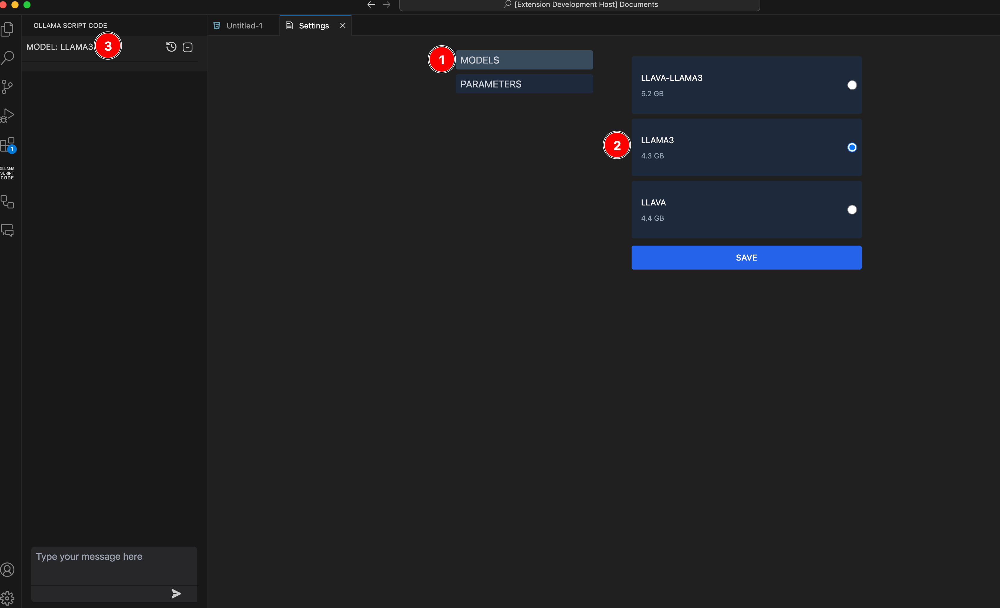

## OLLAMA SCRIPT CODE

Ollama Script Code is a powerful copilot for your Visual Studio Code, leveraging the Ollama framework to enhance your coding experience.
It provides intelligent suggestions, assists in code generation, and automates repetitive tasks, allowing developers
to focus on what matters most—building efficient and maintainable software. Seamlessly integrated with VS Code,
Ollama Script Code helps streamline your workflow, whether you're debugging, writing documentation, or experimenting with new code.

## FEATURES

- 🚀 As good as Copilot.
- 🔐 No telemetry or tracking
- 🔬 Works with any language coding or human one.
- 📦 Easy to install and use
- interactive chat
- 🧠 Intelligent autocompletion

## REQUIREMENTS

- Ollama script code requires the Ollama framework to be installed on your machine. You can download it from the official website: [Ollama Framework](https://ollama.com)
- After installing the Ollama framework, you need to pull a one model, using this command `ollama pull <name_model>` example `ollama pull llama3`
- The equipment must have a minimum of 16GB of RAM to run the extension.

## HOW TO USE

- Install the extension from the Visual Studio Code Marketplace.
- Pull you model using the command `ollama pull <name_model>` in your terminal.
  
- Now you can see your model using this command `ollama list` in your terminal.
  
- Go to the settings.
  
- Set the model in the settings.
  
- Now you can use the parameters for each model.
  
- Autocomplete is working when you typing and press (SPACE), you can use the autocomplete by pressing the enter key.
  
  
- the autocomplete not working with LLAVA model.

## NOTES

- the extension is in the beta version, so it may have some bugs.
- the extension is free to use, but you need to have the Ollama framework installed on your machine.
- the extension does NOT COLLECT any data from the user.
- the chat appears in the left sidebar, you can open it by clicking on the chat icon.
- the autocomplete appears when you typing and press (SPACE), you can use the autocomplete by pressing the tab key.
- PARAMETERS is not working with the LLava model.

## MODELS

- Currently, Ollama script code support all models of Ollama framework.
- You can use any model you want.
- LLava model is included in the extension, but you need to a good memory to run it.

## LLAVA MODEL

- Activate the LLava model by setting it in the settings.
- Pull the LLava model using the command `ollama pull llava` in your terminal.
- Go to the settings and set the model.
  
  

- After activating the LLava model, you can upload images. This input will only work with images.
- The extension is not compatible with the LLAVA-LLAMA3 model. For now, you can use the LLava model.
- The PARAMETERS is not working with the LLava model.

- example how to use it:
  
- the extension of images accepted is (png, jpg, jpeg, gif, svg).
